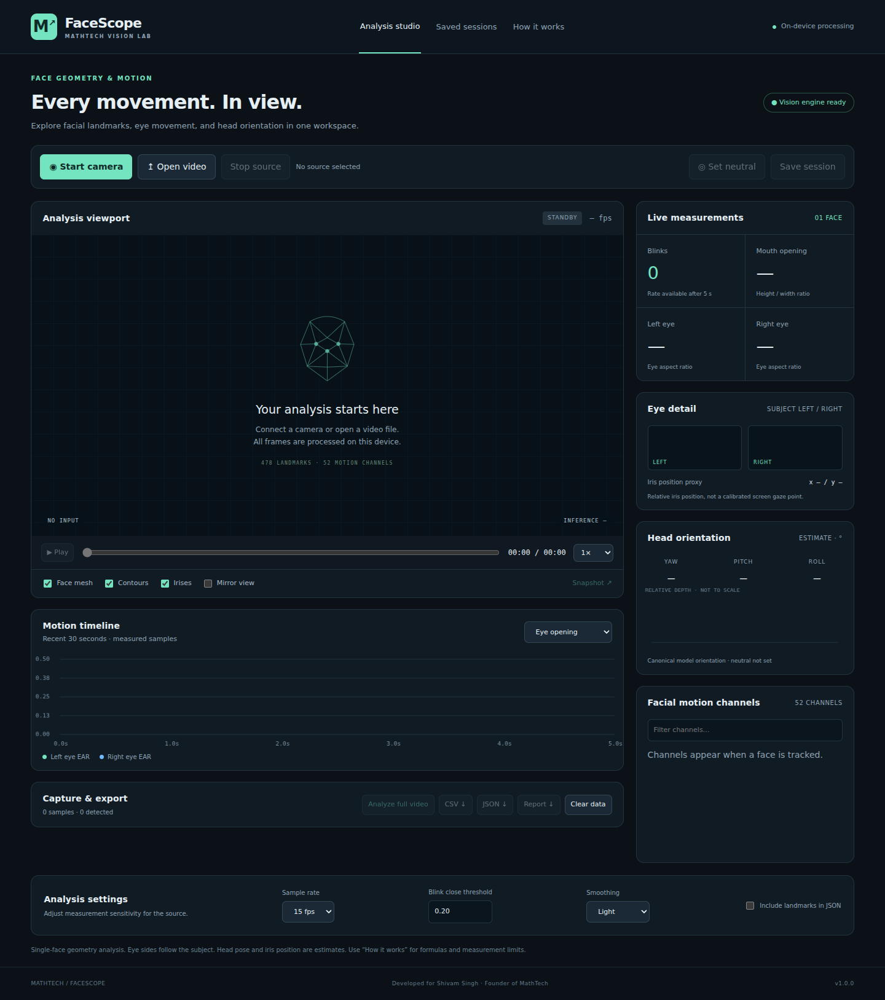

# MathTech FaceScope

**A complete local application for face geometry and visible-motion analysis.**

Developed for **Shivam Singh, Founder of MathTech**.

FaceScope recreates the observable capabilities in the supplied demonstration: a dense face mesh, iris markers, eye close-ups, facial motion coefficients, and head orientation. It is an original implementation using MediaPipe, not the proprietary software shown in the recording.



## Start in one command

Requirements: **Python 3.10 or newer** and a current desktop **Chrome or Edge** browser with WebAssembly and WebGL 2 enabled. No pip installation, Node.js, API key, GPU, or cloud service is needed for normal use. The model, JavaScript runtime, and SIMD / non-SIMD WASM files are included.

1. Extract the ZIP completely.
2. On Windows, double-click **start_windows.bat**. On macOS/Linux, run `bash start.sh`.
3. Open **http://127.0.0.1:8765** if a browser does not open automatically.
4. Choose **Open video** and select your MP4/WebM file, or choose **Start camera**.

Manual launch:

```bash
python run.py
```

On systems where Python is named `python3`:

```bash
python3 run.py
```

Alternative port and custom data location:

```bash
python run.py --port 8766 --data-dir ./my-sessions --no-browser
```

Do not open `web/index.html` directly with `file://`. The local server is needed for worker, model, and session access. Keep the terminal open while using the application. Press Ctrl+C to stop it.

## Included capabilities

| Area | Working features |
|---|---|
| Sources | Webcam, local browser-decodable video; play/pause, scrub, speed, camera release |
| Tracking | One face, 478 landmarks, tessellation, contours, iris markers, optional mirrored view |
| Eye analysis | Subject-left/right crops, pixel-correct eye aspect ratio, bilateral blink events, extended closure events, tracked-time blink rate |
| Face motion | Mouth opening ratio, all 52 returned blendshape coefficients, searchable live channel list |
| Head / iris | Approximate yaw, pitch, roll; relative iris-position proxy; 30-sample neutral calibration |
| Visuals | Recent 30-second charts, relative-depth face mesh, inference latency, measured inference throughput |
| Offline analysis | Full-video sampled scan at 5–30 fps, progress, cancellation, missing-face records |
| Data | Local SQLite sessions, session review, reload persistence, deletion |
| Exports | Measurement + blendshape CSV, structured JSON, optional raw landmarks / matrices, PNG snapshot, printable HTML report |
| Interface | Responsive dark workspace, keyboard-operable controls, guide, clear error messages |

## Suggested workflow

1. Use clear footage of one face. Source videos with existing graphics, eye insets, or face overlays can affect detection; original camera footage is preferable.
2. Set a sample rate. Use 15–30 fps for blink experiments. A short blink can fall between sampled frames, especially at 5 fps.
3. To personalize the baseline, press **Set neutral**, look forward with eyes open, and hold still for 30 successfully tracked samples. For a video, play a neutral segment. This starts a new calibrated dataset when complete.
4. For a reproducible file analysis, choose **Analyze full video**. The application seeks through the file at the requested sample times. This can run slower than real time on modest devices. Browser seeking selects decoded frames; it is not frame-index-exact demuxing.
5. Export CSV for spreadsheets, JSON for a downstream application, or Report for a human-readable summary. Open the report and print to PDF if desired.
6. Use **Save session** to retain the measurements. Review them in **Saved sessions**. Reopen the original video separately for source playback.

Camera capture and ordinary video playback sample automatically while running. A seek, source switch, analysis-setting change, completed calibration, or Clear data starts a fresh dataset. Save/export important measurements first. Smoothing is for the live display only; exported measurements remain raw. Mirror changes the display, not the exported coordinates or eye labels.

## What is measured

- **478 landmarks:** estimated normalized image coordinates, including iris landmarks. The depth component is relative, not a measured depth map.
- **52 blendshapes:** model animation coefficients. They are not emotional-state probabilities.
- **EAR:** `(distance(p2,p6) + distance(p3,p5)) / (2 × distance(p1,p4))`, using pixel distances to account for source aspect ratio.
- **Blink:** both EAR values fall below the close threshold and at least one returns above the open threshold, after 0.05–0.8 s. Longer closures are separate events. Lost tracking, backward time, and gaps over 0.5 s invalidate an unfinished event. The rate denominator includes only adjacent tracked samples with gaps ≤0.5 s; it becomes visible after 5 tracked seconds.
- **Mouth ratio:** inner-lip distance divided by mouth-corner distance.
- **Pose:** approximate Euler angles from the canonical-face transform, using `R = Rz(roll) Ry(yaw) Rx(pitch)` with column-major matrix storage and uniform scale removed. Axis signs refer to that model coordinate convention, not clinical anatomy. Neutral calibration subtracts baseline angles for display.
- **Iris x/y:** average of the two iris positions in local eye-corner coordinates. x is along the left-to-right image axis, typically near 0.5 at center; y is perpendicular displacement in eye-width units. This is **not calibrated screen gaze**.

The app does not identify people, diagnose conditions, or infer emotions, honesty, attention, or intent. Accuracy has not been established on a labeled benchmark. Tracking coverage means “sampled frames with a detected face,” not accuracy. See [docs/METHODS.md](docs/METHODS.md).

## Storage and limits

- Inference runs in a browser worker. No frames are sent to the Python service or an external service.
- Source videos and webcam recordings are not stored. Only explicit session saves write data to `data/facescope.sqlite3`.
- By default, keep up to **18,000 measurement samples** per dataset. With raw landmarks enabled, the limit is **1,200 samples** to keep exports and browser memory manageable.
- The app alerts you when capture reaches a limit. Export and clear before continuing. Full-video analysis checks the expected sample count before scanning.
- The local API accepts at most 64 MiB per session. The session list shows the newest 200 sessions. Database storage is otherwise limited by disk space; delete sessions you no longer need.
- Server access is restricted to localhost, with Host checking, same-origin write validation, request limits, and parameterized SQLite queries. This is a **single-user local application**, not a hosted multi-user enterprise service.

## Project structure

```text
MathTech-FaceScope/
  run.py                    Application entry point
  start_windows.bat         Windows launcher
  start.sh                  macOS / Linux launcher
  server/app.py             Local HTTP + validated SQLite session API
  web/index.html            Workspace interface
  web/styles.css            Responsive design system
  web/app.js                Source lifecycle, capture, calibration, session workflow
  web/tracker.worker.js     Worker-isolated MediaPipe inference
  web/metrics.js            Pure analysis and event-detection functions
  web/render.js             Overlays, eye crops, depth view, charts
  web/export.js             JSON, CSV, image, report download helpers
  web/vendor/               Pinned MediaPipe runtime, WASM, upstream license
  web/models/               Bundled Face Landmarker model
  assets.lock.json          Asset origins, byte lengths, SHA-256 digests
  scripts/check_assets.py   Verify / restore bundled assets
  tests/                    Math, API, and browser integration tests
  docs/                     Architecture, methods, API, validation notes
  data/                     Local session database (created at first launch)
```

## Verify and develop

Normal use needs only Python and a browser. Node.js 20+ is needed only for JavaScript tests.

```bash
python scripts/check_assets.py
python -m unittest discover -s tests -p "test_*.py" -v
node --test tests/*.test.mjs
```

Optional full browser test (requires a supplied video with a visible face and Playwright):

```bash
npm install --no-save --package-lock=false playwright
npx playwright install chromium
node tests/browser_e2e.cjs /absolute/path/to/video.mp4
```

`BROWSER_PATH` may point to an existing Chromium executable; `PLAYWRIGHT_MODULE` may point to an installed Playwright module; `TEST_OUTPUT` chooses the test-output directory. The test launches its own local server and uses a temporary database. Its neutral-calibration step expects an open-eyed neutral segment near the start of the supplied video. See [docs/VALIDATION.md](docs/VALIDATION.md) for the included validation results and limits.

## Troubleshooting

| Symptom | Action |
|---|---|
| Python not found | Install Python 3.10+; on Windows enable “Add Python to PATH.” Try `py -3 run.py`. |
| Address already in use | Run `python run.py --port 8766`. |
| Engine unavailable | Verify assets with `python scripts/check_assets.py`; enable WebGL; try current Chrome/Edge; reload. |
| Missing or damaged assets | Run `python scripts/check_assets.py --download` with internet access to restore files from the pinned manifest. |
| Camera denied | Allow camera access in browser settings; close other apps using it; use a local video instead. |
| Video cannot decode | Convert to MP4 with H.264 or WebM with VP8/VP9; avoid unsupported codecs. |
| No face | Show one unobstructed face with good lighting; remove picture-in-picture insets if possible. |
| Slow live tracking | Reduce source resolution, close other GPU/CPU-heavy apps, lower sample rate, or use full-video analysis. |
| Too many blinks | Set neutral with both eyes fully open; lower the close threshold; inspect EAR traces and compare with footage. |
| Session save fails | Check disk permissions, free space, request size, and server output. Export JSON to retain current data. |
| Cannot access from phone / LAN | Intentional: the server is local-only. This release does not provide HTTPS, remote authentication, or LAN hosting. |

## Attribution and licensing

Original application code: MIT License, copyright 2026 Shivam Singh / MathTech. MediaPipe runtime and model assets are third-party components and are not relicensed by the application MIT license. See [THIRD_PARTY_NOTICES.md](THIRD_PARTY_NOTICES.md) and the bundled upstream license. Model and runtime versions are pinned in `assets.lock.json`.

Reference: [Google MediaPipe Face Landmarker Web documentation](https://ai.google.dev/edge/mediapipe/solutions/vision/face_landmarker/web_js).
